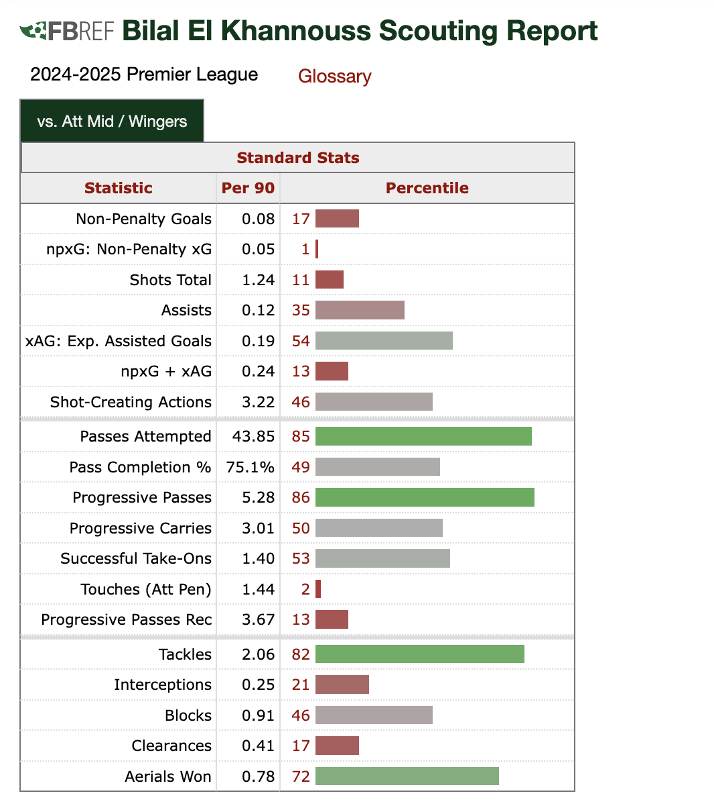

```{r setup, include=FALSE}
knitr::opts_chunk$set(echo = TRUE)
library(knitr)

```
```{css, echo=FALSE}
h1, h2, h3, h4, h5, h6 {
  text-decoration: underline;
  margin-top: 50px;      /* creates big spacing between sections */
}

a {
  color: blue;            /* makes links look like links */
  text-decoration: underline;
}
```

# Premier League 2024/2025 Midfielder Player Profiling Project

# Background
In soccer, it is difficult to gauge how good players are due to there being so many responsibilities that they take on, like tackling, passing, or scoring. In addition, there are 11 positions in which each one calls upon certain responsibilities more or less than another. Before this project, I was really interested in understanding how good midfielders are statistically, despite midfielders having very different roles across teams. I was also interested in seeing how I could account for statistical discrepancies due to the level of a player’s team within a league. My goal was to create a project that provided an objective and accurate view of midfielders despite the complexity to player analysis. I decided to use Premier League midfielder stats from 2024/2025 from Football Reference to create an R shiny project. I chose to get my data from Football Reference since the website has a significant amount of player data(over 100 metrics per player). The project displayed midfielders’ overall numeral ability and their numeral abilities that make up the overall abilities as well as an estimated transfer value.

# Failed API + Excel Data

Initially, I tried to access the Football Reference data using an API(Application Programming Interface) that would enable me to easily access all the player profiles from the league and season. However, Football Reference guards well against data scraping so the only Github API I found had limited player data.

As a result, I manually copied all of my player data from Football Reference into Excel. The process took around some hours, but I eventually copied all of the players’ league data from the 2024/2025 Premier League season in addition to some team data for each player.

# Short Data Intake Script

After that, I created a Midfielder Data R Script that took in all the data from my Excel file and added percentiles for each stat. Also, the script created the composite values and the overall composite values for my players.


```{r shooting-table, echo=FALSE}
### Shooting Variable
kable(data.frame(
  Shooting = c("NP-XG", "Share of NP-XG", "Non-penalty goals",
               "Non-penalty goals/Team NP-XG", "Shot Total"),
  Description = c("Expected goals not from penalties",
                  "Percent of the teams NP-XG that a player has",
                  "Goals not coming from penalties",
                  "Goal performance contribution from the given team xg",
                  "How high the average expected goals is per shot"),
  Weight = c(25, 25, 10, 10, 30)
))

### Passing Variable
kable(data.frame(
Passing = c("Passes Completed", "Share of Passes Completed",
"Passes Completion Percentage", "Average Passing Distance",
"Assists", "Expected Assists",
"Progressive Passes/Completed passes"),
Description = c("The amount of successful passes",
"A player’s passes out of the team’s passes completed",
"The percentage of passes that are successful",
"Indicates that the player’s passes are moving the ball around with quality",
"The amounts of assists(passes to another player that scores)",
"The expected amount of assists based on the shooting players npxG",
"% of completed passes forward more than 10 yards"),
Weight = c(10, 10, 20, 20, 5, 15, 20)
))

### Dribbling Variable
kable(data.frame(
Dribbling = c("Successful Take-Ons", "Share of Successful Take-Ons",
"Dribbles completion percentage", "Progressive carries"),
Description = c("Amount of successful dribbles",
"A players dribbles completed of the teams",
"The percentage of dribbles that are successful",
"Amount of times a player drives with the ball forward without taking on a player"),
Weight = c(15, 15, 30, 40)
))

### Defending Variable
kable(data.frame(
Defending = c("Tackles Completed", "Share of Tackles Completed",
"Tackles completion percentage", "Aerials completed",
"Aerials completion percentage"),
Description = c("Amount of successful tackles",
"A player’s tackles out of the team’s tackles completed",
"The percentage of tackles that are successful",
"Amount of times a player with the ball in the air",
"The percentage of aerials that are successful"),
Weight = c(15, 10, 35, 15, 25)
))

### Positioning Variable
kable(data.frame(
Positioning = c("Interceptions", "Blocks", "Progressive Passes Received",
"Touches", "Share of Touches"),
Description = c("Amount of passes intercepted by an opposition player",
"Amount of blocked passes or shots",
"Amount of pass received forward by a player",
"Amount of times a player touches the ball(dribbling, passing)",
"A player’s touches out of a team’s touches"),
Weight = c(30, 20, 20, 15, 15)
))

### 90s Variable
kable(data.frame(
Nineties = "90s played",
Description = "Amounts of minutes played over 90 minutes",
Weight = 100
))

### Overall Variable
kable(data.frame(
Overall = c("Shooting Variable", "Passing Variable", "Dribbling Variable",
"Defending Variable", "Positioning Variable", "90s Variable"),
Weight = c(15, 20, 15, 25, 10, 15)
))


```

# Explanation for weightings

Although I didn’t have a statistical basis for my weightings, I made sure to use volume, accuracy, and shares of a team stat across different sections of the complex metric to account for nuances. A great example is when I incorporated all three for passing. I counted passes completed per game, pass accuracy, and share of team passes to see how much a player passes, how dependent their team is on their passes, and how efficient their passing was. Not only that, but I also accounted for average pass distance and expected assists to find out the difficulty of a player’s passes and their contribution towards goalscoring opportunities.

# Dashboard

When you enter the project you will see a dashboard that has a search bar at the top of the page, a leaderboard for Overall Composite and buttons to see the other leaderboards in the top left, an adjustable player scatterplot in the bottom left, and a player filter on the whole right side of the page. The leaderboard are overall, shooting, dribbling, passing, defending, positioning, and transfer value

# Leaderboards

The leaderboards rank players by a composite value and display players and their information in rows. You can access a player’s profile by clicking on their row.

# Scatterplot

The scatterplot allows you to edit the x and y axis by putting in specific or composite stats and you can see how each player performs in those stats. You can click on the midfielder types that you would like to not appear on the scatterplot. You can click the names checkbox above the scatterplot to have all midfielders names appear above their points. You can also click on a player's point, hover over a few lines of information, and go directly to their player profile.

# Player filter

The player filter allows you to toggle a player’s composite values, team, age, and positional role. Once you click on the filter button, players are organized from highest Overall Composite value to lowest with the same row appearance as the leaderboard. There will also be a scatterplot for the filtered players on the filter results page. You can access a player’s profile by clicking on their row.

# Player Profile

The player profile shows a player’s image and information about the player at the top of the screen and allows you to access their team’s page. One of those bits of information is an Estimated Transfer Value that takes into account Overall Composite values, 90s, age, and the amount of elite abilities a player has. To the right, there are links to the names of similar players that you can click on to go to their page. Under that, there is a radar chart with the player’s composite values as their different points and a collapsable table with the player’s specific stats and the weightings for each stat in their respective composite value.

# Team Page

The team page shows the average composite value of the players on a team, what the ranking of those values are in the league, and player information rows. At the bottom of the page is a bar graph for the amount of 90 minute segments played by each player.

# Lessons Learned

I learned to be cognizant of factors that might unfairly affect a player’s stats, like a player’s team and action volume. I also learned to always use efficiency and volume as countering elements that identify proficiency in certain attributes.

# Bilal El Khannouss Example

Bilal El Khannouss seemed like an average player in the 2024/2025 Premier League season for a Leicester City team that finished 18th in the league. He recorded 2 goals and 3 assists across the league season. El Khannouss was a 20 year old attacking midfielder who appeared to be a very good passer and an okay defensive presence based on his football reference profile. On the other hand, he appeared to be an underwhelming shooter and dribbler.

```{r radar-chart, echo=FALSE, out.width="70%", fig.align="center"}

```


However, the football reference profiles do not account for the team which a player plays for. El Khannouss’ Leicester City team scored a measly 33 goals across the 38 game season, illustrating the lack of quality in the attack for the squad that limited his attacking opportunities. Despite this difficulty, he managed to score a tenth of the team’s expected goals and completed a fifth of the team’s successful take-ons, indicating he was heavily relied upon in the offensive third. In the El Khannouss’ radar chart from my project, you can see that in actuality, he was an excellent dribbler, in fact the second best in the league. He was also a decent passer and defender and okay goalscorer. Bibal El Khannouss is an example of a player whose general stats are not reflective of his ability due to his team level. The Overall Composite value accounts for nuances like these that result in inaccurate understandings of a player’s capabilities.

```{r fbref-radar, echo=FALSE, out.width="80%", fig.align="center"}
knitr::include_graphics("radar.png")
```

# Takeaways

From the dataset, there were some interesting trends between factors. 
The  first of which was that there was a negative correlation between age and dribbling composite. I find this a bit surprising because a player's technical ability gets better as they age due to repetition. A midfielder’s dribbling ability may get worse as they age due to physical decline in speed and agility. Also, after a player has played a higher amount of games, opponents start to notice frequent dribbling moves and organize themselves to prevent those players from completing those dribbles. 


```{r fbref-scatter, echo=FALSE, out.width="80%", fig.align="center"}
knitr::include_graphics("scatter.png")
```

Another takeaway I had was that midfielders on teams at different levels will be better at certain attributes. For example, in the Passing Composite vs Defence Composite scatterplot featuring players from 1st place Liverpool and 20th place Southampton, one can clearly see that Liverpool is better at passing and Southampton is better at defending. A bigger team possesses the ball more and is trying to create goalscoring chances while a smaller team spends more time without the ball trying to prevent goals, resulting in both teams having different profiles of players. 

```{r fbref-scatter2, echo=FALSE, out.width="80%", fig.align="center"}
knitr::include_graphics("scatter2.png")
```
# Who the project could be used for

Teams can see what skills players have that they can use in different games based on the composite values. Teams can also use the Overall Composite metric for general player evaluation and transfer decision purposes.

Fans of the sport can use the project to have a general sense of how good midfielders are and fans who are slightly more interested can look at the specific stats provided in the collapsible table.

In addition, the estimated transfer value can provide coaches with the true value of a player, so they could find undervalued players in the market.

Also, the scatterplot can be used to identify trends across different midfield types. Also, sports enthusiasts can see if one metric is predictive of another by a positive or negative correlation for midfielders.

# Limitations of the project

The project uses data from 109 Premier League players from a single Premier League season, so the composites might be a bit less accurate when used in leagues that are stylistically different or at lower levels. The weightings for specific stats in the overall composite values are subjective. There could also be more specific stats added to make the metric account for more in-game situations. Coaches can contact the author to adjust the stat weightings and get those reflected in the overall composite values.

Link to my project

https://olivierxatart.shinyapps.io/playerprofilingproject/

Link to my data source

https://fbref.com/en/comps/9/2024-2025/2024-2025-Premier-League-Stats


